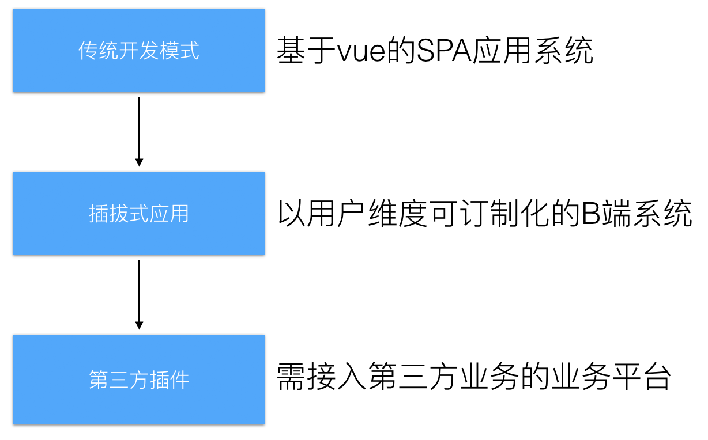
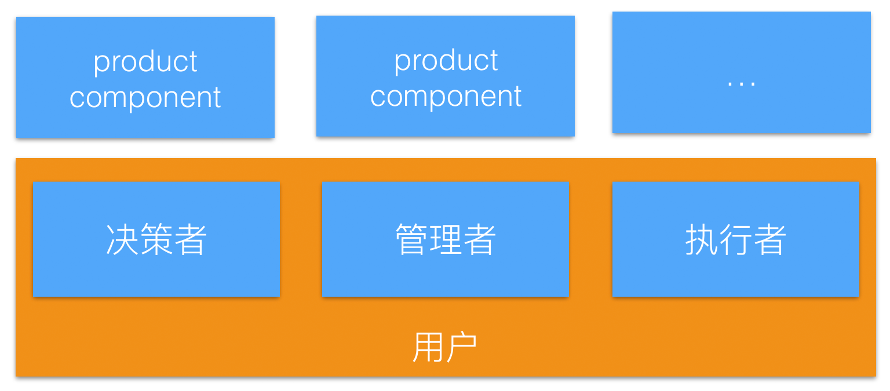
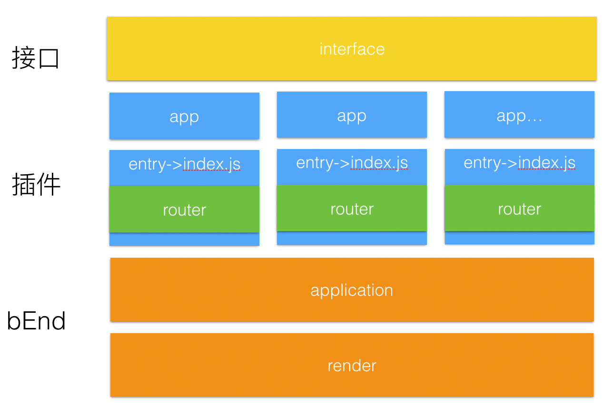
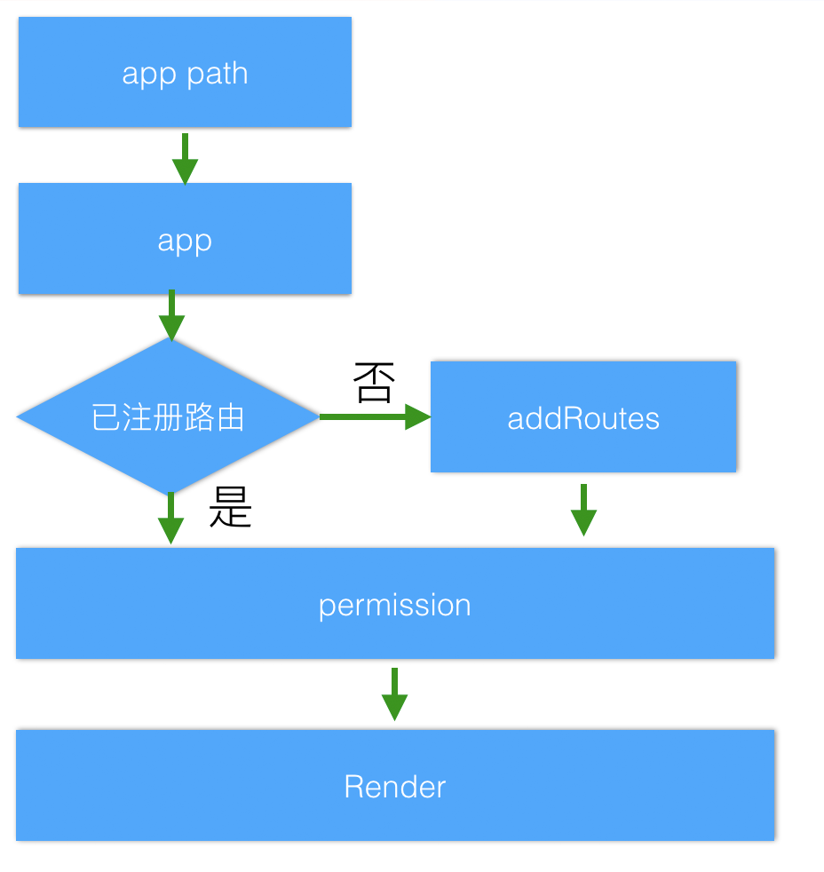
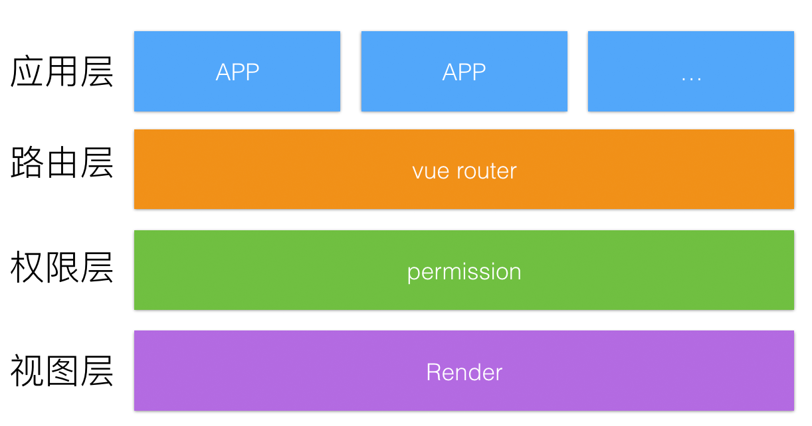
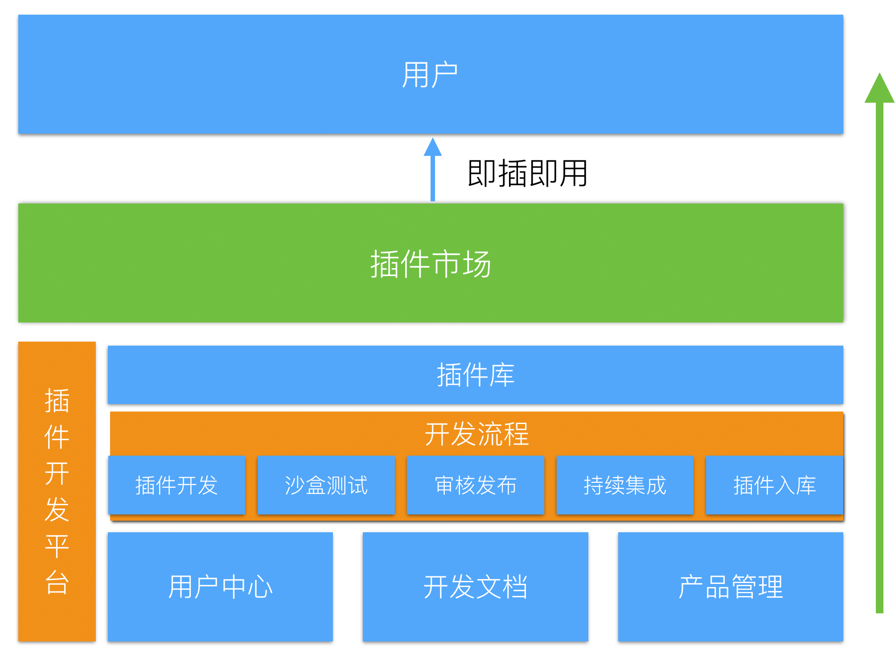

[](https://bearfe.github.io/doc)

bEnd是Vue 驱动的插件化B端服务方案，即插即用方式让B端平台用户降低理解成本，简化操作步骤，缩短跳转流程，从而快捷、方便、个性、定制化地享受线上运营服务；支持第三方接入开发，提供开放拓展方案及技术支持，为第三方开发者提供技术服务。

## 适用场景
1. 基于vue的SPA应用系统


<br/>
<br/>

2. 以用户维度，即插即用，定制化的B端系统



3. 需接入第三方业务的业务平台

## 适用业务
1. 存在单用户多平台，切换成本高的，用户体验差的业务系统
2. 业务模块多，部分功能和服务重复、累赘、使用频率低，对用户使用干扰大等特点的业务
3. 业务针对性强，用户理解成本高，操作路径长等

## 功能定位
1. 将业务子系统模块化集中到一站式平台上，统一对外服务，
2. 给不同用户赋予不同的权限让其能够访问平台特定的业务模块同时禁止其访问无权限的业务模块
3. 用户可以定制平台功能模块，即插即用

4. spa体验，统一的UE及交互

## 特性
1. 快速接入新的功能模块，并对模块进行版本管理，业务模块（App）移植性强，可单独部署，也可整合到一站式
2. 业务模块分布式开发，代码仓库可集中管理也可单独管理
3. 开闭原则，新模块的接入不需要修改已有模块，不影响其它app的功能


<br/>
<br/>

4. 即插即用，子业务模块可以根据需要动态加入一站式平台


<br/>
<br/>

5. 权限层控制每个用户所维护的个性化插件


<br/>
<br/>

6. 支持第三方接入开发，提供开放平台搭建方案及技术支持，为开发者提供技术服务


<br/>
<br/>

7. 享用 Vue + webpack 开发环境、本地开发mock支持、deploy部署、集成SDK(需支持第三方开发的业务)


## [使用](https://bearfe.github.io/doc/guide/start.html#%E6%96%B9%E5%BC%8F%E4%BA%8C%EF%BC%9Agit-clone)

安装依赖
``` bash
npm install
```
启动开发环境
``` bash
npm run dev
```

编译生产环境
``` bash
npm run build
```

发布到开发机,host01 为主机名(配置于./config/proxy.js)，服务器对应设置receiver.php 或者 [receiver](https://github.com/fex-team/receiver)
``` bash
npm run deploy host01
```

查看模块分析报告
``` bash
npm run build --report
```

## 文档部分

- [主页](https://bearfe.github.io/doc/) - bEnd 介绍
- [快速起步](https://bearfe.github.io/doc/guide) - bEnd 开发指南

## LICENSE

[MIT](https://github.com/ElemeFE/element/blob/dev/LICENSE)
